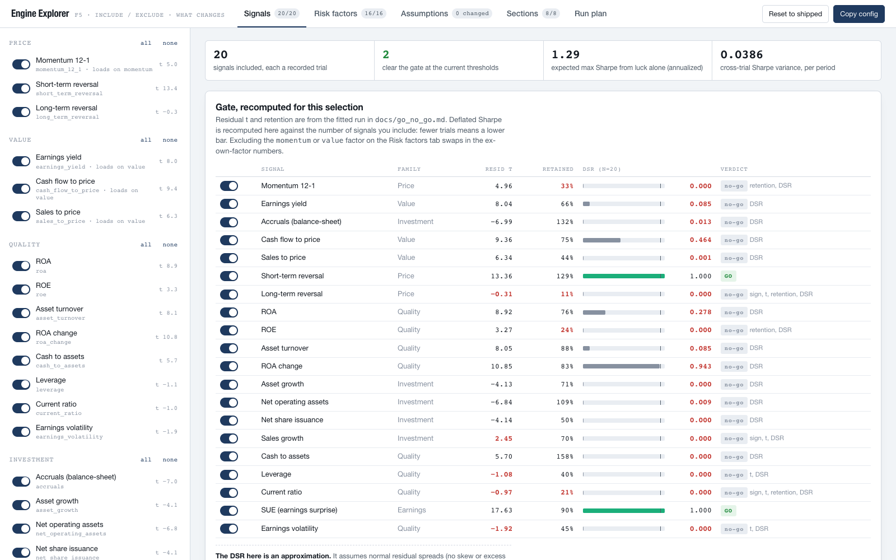

# Equity Alpha Engine — public edition

**[Open the interactive mock website](https://shaylazheng.github.io/equity-engine-public/mock/)**

**[Download the interactive Engine Explorer HTML](https://github.com/shaylazheng/equity-engine-public/raw/refs/heads/main/mock/index.html)** · [View its source](mock/index.html)

[](mock/index.html)

An offline, long-only equity research engine with point-in-time data contracts, residualized signals, attribution ledgers, multiple-testing-aware evaluation, portfolio construction, transaction costs, tax lots, and trade-list generation.

## Run

Install Python 3.13 and uv, then:

```sh
uv sync
uv run python scripts/demo.py
uv run pytest
```

The demo generates a deterministic synthetic panel of 120 firms (seed 77), runs the signal/risk/backtest pipeline, and writes equity, score, and trade CSVs to `output/`. All demo observations are generated locally; no network is used by the engine. Synthetic returns illustrate mechanics and do not establish investment performance.

## Interactive mock dashboard

Save the HTML and open it in your browser, or open `mock/index.html` after cloning. It is self-contained and needs no server or external fonts. Signal switches recompute the illustrative gate, and the risk-factor, assumption, section, and run-plan tabs let you explore a configuration.

This is the original static mock with recorded research summaries, not a live backtest. Its historical private-workspace commands are labeled as references; they are not shipped with this edition. Use `uv run python scripts/demo.py` for the executable synthetic workflow. Mock selections do not run the Python engine.

## Architecture

- `qe-core`: three-date point-in-time contract, synthetic generator, attribution ledger.
- `qe-data`: pure identifier, delisting, and fundamental transforms.
- `qe-signals`, `qe-risk`, `qe-combine`: signals, factor residualization, attributable composites.
- `qe-eval`: purged validation, trial registry, Deflated Sharpe, SPA, Reality Check, PBO.
- `qe-backtest`, `qe-tax`: cost-aware portfolio construction and lot accounting.
- `qe-live`: offline trade lists only.
- `qe-report`: self-contained analytical tearsheets.

This edition preserves the computational code and tests while using generated examples. It is maintained separately from the private research workspace. Changes are exported selectively; the private workspace is never mirrored automatically.
